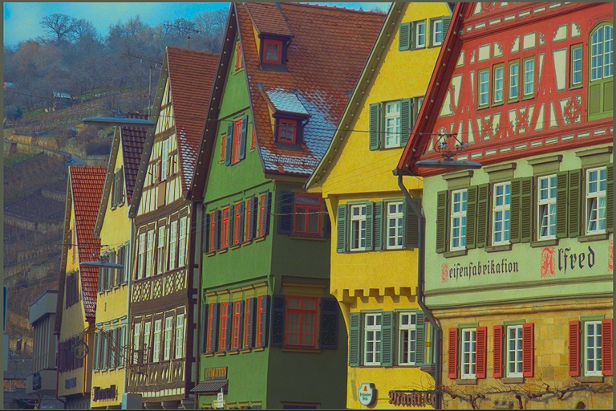

# Color-Transfer-Between-Images

## Examples
Below are some examples showing how to run the <code>main.py</code> demo and the associated color transfers between images.

<code>$ >python main.py --src source/s6.bmp --target target/t6.bmp</code>

	
	
	

 

<code>$ >python main.py --src source/s3.bmp --target target/t3.bmp</code>

	
	
	

 

<code>$ >python main.py --src source/s7.jpg --target target/t7.jpg</code>

	
	
	

<code>$ >python main.py --src source/s10.jpg --target target/t10.jpg</code>

	
	
	

## References
- [chia56028/Color Transfer between Images]](https://github.com/chia56028/Color-Transfer-between-Images)
- [paper: Color Transfer between Images](https://www.cs.tau.ac.il/~turkel/imagepapers/ColorTransfer.pdf)
- [Super fast color transfer between images](https://github.com/jrosebr1/color_transfer) 